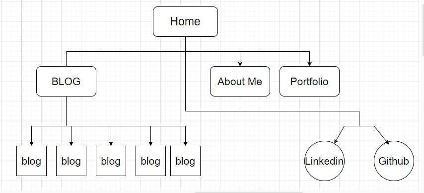

 
# Portfolio
[Vittorio Bianco's Portfolio](https://heuristic-bassi-451a50.netlify.app/index.html) 

 [Github Repo](https://github.com/VittorioBianco/VittorioBianco_T1A2)

## Sitemap

## Purpose

The purpose of this portfolio functions as a platform for potential employers and peers to get a rundown of who i am, what I have worked on and accomplished, access my resume or get in touch with me.   Practically the portfolio exercise had the purpose of introducing me to both writing and styling HTML in a real-world scenario.  As previously stated, the target audience for this project would ideally be potential employers and or collaborators.

## Functionality

The website itself has 4 pages; a landing home page with my immediate contact information, a portfolio page that will contain my works and projects, an about me page where I describe who i am and my experience and a blog page that in entirely placeholder.  I am not sure if I will keep this section on the site after the project is completed unless I can find a good reason to do so.

## Tech Stack

Balsamiq Wireframes, HTML, CSS & SCSS

## Screenshots

